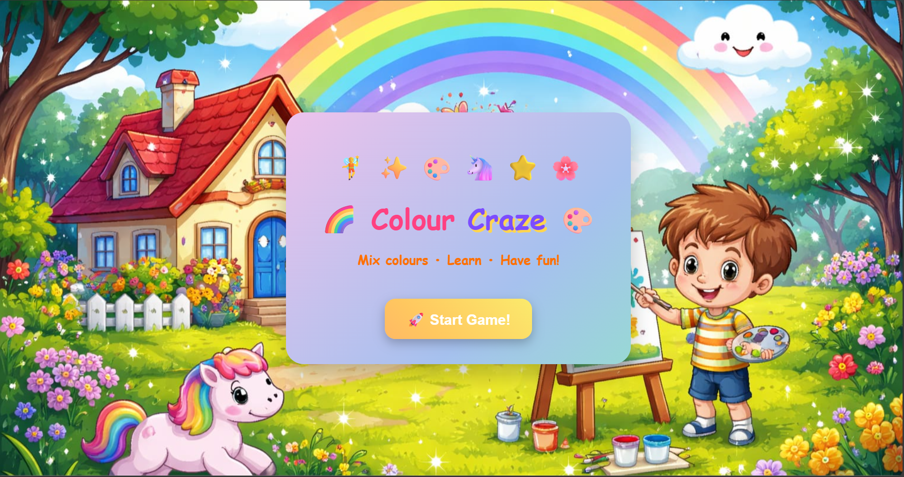
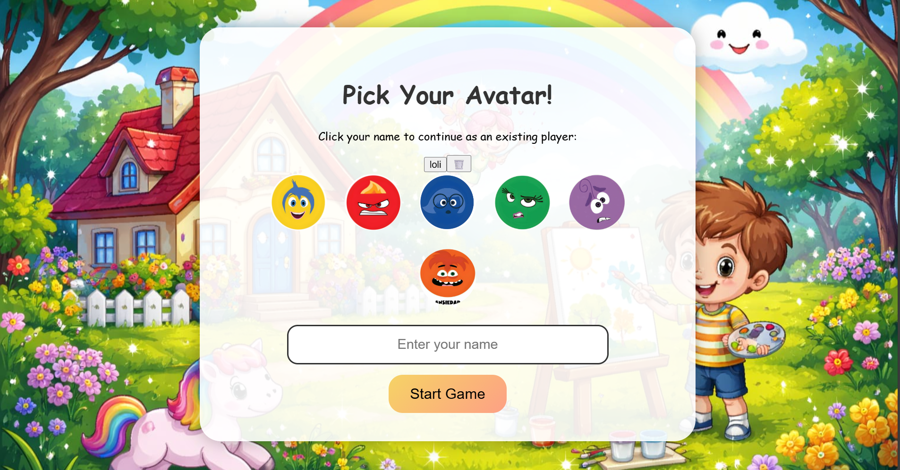
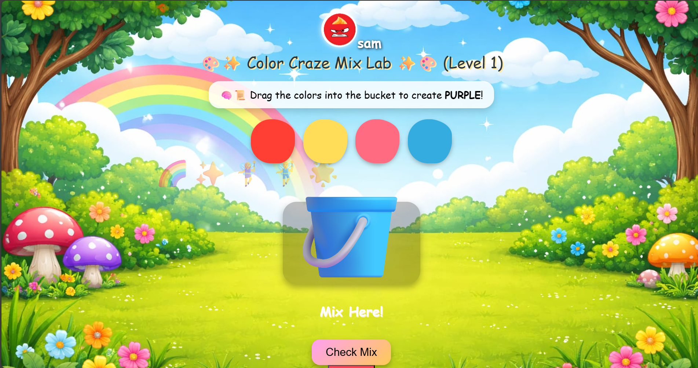
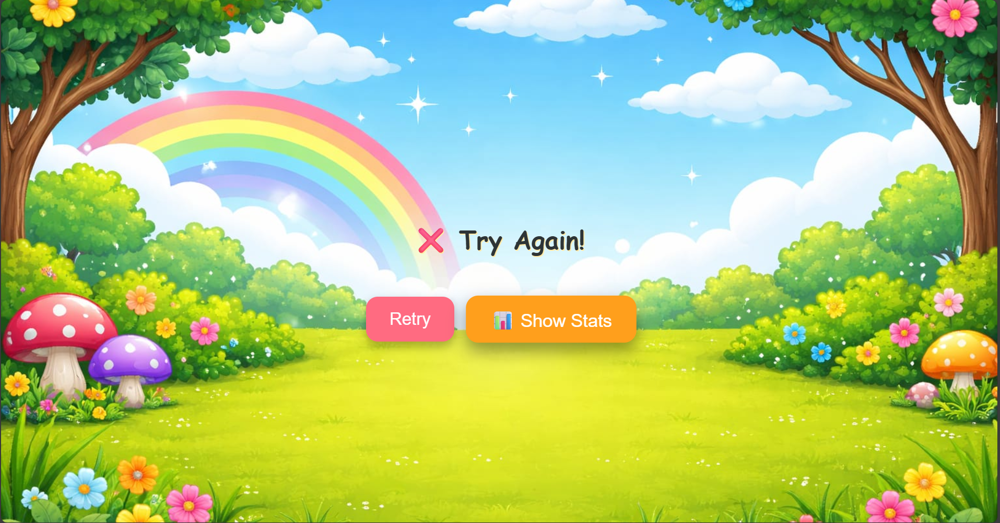
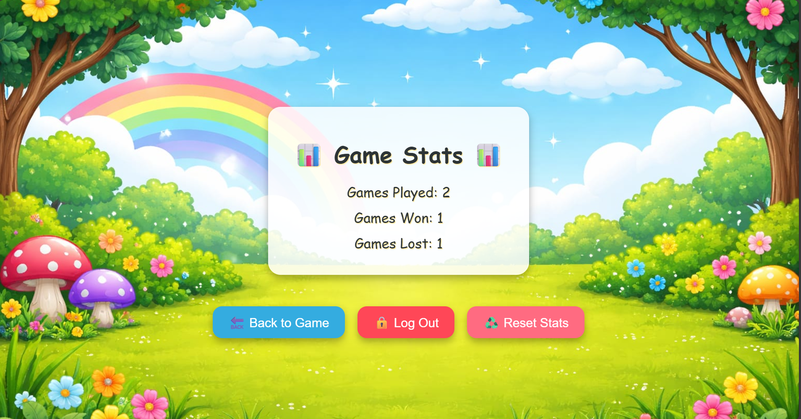

# 🎨 Colour Craze


A fun and interactive color mixing game built with React! Players pick an avatar, mix colors to match target colors, and track their stats across levels.  


---


## 📸 Screenshots

### 1. Home Page



### 2. Authentication Page


### 3. Avatar Selection Page



### 4. Game Page



### 5. Result Page (Passed)


### 6. Result Page (Failed)



### 7. Statistics Page


---


## 💻 Installation & Setup


1. Clone the repository:


```bash
git clone https://github.com/your-username/Colour-Craze.git
```
2.Navigate into the project folder:
```bash
cd Colour-Craze
```
3.Install dependencies:
```bash
npm install
```
4.Start the app:
```bash
npm start
```
5.Your default browser should open the game automatically.

## 🕹 How to Play
Enter your name and pick an avatar on the Avatar Page.
Drag the available colors into the bucket to mix them.
Try to match the target color shown at the top.
Click Check Mix to see if you matched the color correctly.
If you succeed, advance to the next level.
View your statistics anytime by clicking Show Stats.
Log out by clicking the Log Out button.
📊 Player Progress
Player stats (played, won, lost) and current level are automatically saved.
When you log back in with the same player name, you continue from where you left off.
## 🎨 Features
Avatar selection with sound effects
Multiple levels with color mixing challenges
Player statistics tracking (played, won, lost)
Smooth background music and win sounds
Save and continue progress
## ⚙ Tech Stack
React.js
LocalStorage for player data persistence
HTML, CSS, JavaScript
## 📂 Project Structure


```
Colour-Craze/
├─ public/
├─ src/
│  ├─ assets/
│  ├─ components/
│  ├─ styles/
│  └─ App.js
├─ package.json
└─ README.md
```
