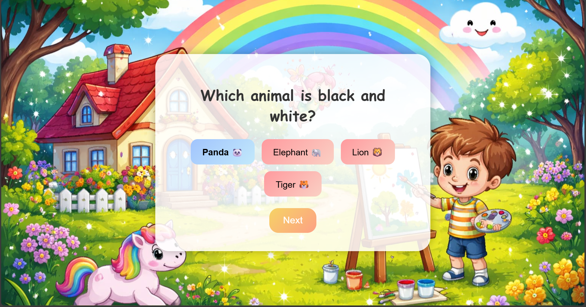

# 🎨 Colour Craze - Mix Lab


**Colour Craze** is an interactive color mixing game built with React. Players can choose an avatar, track their game progress, and experiment with colors to create target colors across multiple levels.


---


## Features


- 🖌️ **Avatar Selection:** Pick an avatar and save it to your profile.
- 🎯 **Color Mixing Challenges:** Drag and drop colors to mix and match target colors.
- 📊 **Statistics Tracking:** Keep track of games played, wins, losses, and current level.
- 🔄 **Save Progress:** Player stats and levels are saved automatically to LocalStorage.
- 🎵 **Audio Effects:** Background music, click sounds, and win sounds for immersive gameplay.
- 🔒 **Profile Management:** Existing players can continue their progress or delete profiles.


---


## Installation


1. Open a terminal and run the following commands:


```bash
# Clone the repository
git clone git@github.com:asmien/Colour-Craze.git


# Navigate into the project folder
cd Colour-Craze


# Install dependencies
npm install


# Start the development server
npm start
Open http://localhost:3000 in your browser to play the game.
How to Play
Home Page: Click Start to begin.
Auth Page: Log in as an existing player or enter a new player name to create a profile.
Avatar Page: Choose your favorite avatar. If you are an existing player, your previous avatar will load automatically.
Game Page:
Each level has a target color to create.
Drag the colors from the palette into the bucket.
Click Check Mix to see if you matched the target color.
If successful, click Next Level to advance.
If not, click Retry to try the level again.
Statistics: Click the Stats button to view your total games played, wins, losses, and current level.
Logout: Click Log Out to exit your session. Your progress will be saved automatically.
Screenshots
### Home Page


### Authentication Page



### Avatar Page


### Game Page


### Results Page


### Results Page


### Stats Page


Built With
React
HTML5 / CSS3
JavaScript (ES6)
LocalStorage for player data
GitHub for version control
License
This project is open-source. Feel free to use, modify, and share.
